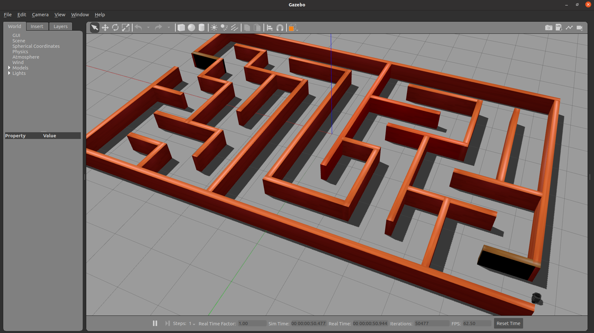

# Turtlebot3 Maze Solver
This is a ros package for demonstrating a maze solver using a turtlebot3 robot in ros simulation.

## System configurations

- Ubuntu 20.04
- ROS Noetic

## Setup & installations

1. Create a ros package & clone this repo.
```
cd ~
mkdir -p catkin_ws/src
cd catkin_ws/src
cd ..
catkin_make
```
3. Clone the following packages in your src folder.
```
cd ~/catkin_ws/src
git clone -b noetic-devel https://github.com/ROBOTIS-GIT/turtlebot3_msgs.git
git clone -b noetic-devel https://github.com/ROBOTIS-GIT/turtlebot3.git
git clone https://github.com/ab31mohit/turtlebot3_mazesolver
cd ..
catkin_make
```
5. Source your package & add robot model in ros environment.
```
echo "source ~/catkin_ws/devel/setup.bash" >> ~/.bashrc
echo "export TURTLEBOT3_MODEL=waffle_pi" >> ~/.bashrc
source ~/.bashrc
```

5. Copy the contents of `others/my_maze1` directory to your `~/.gazebo/models` folder.

6. Check the installations by launching the maze world.
   
```
roslaunch turtlebot3_mazesolver turtlebot3_maze_world.launch
```
If everything works fine, it will open the following world in the gazebo

<div align="center">
  
</div>


